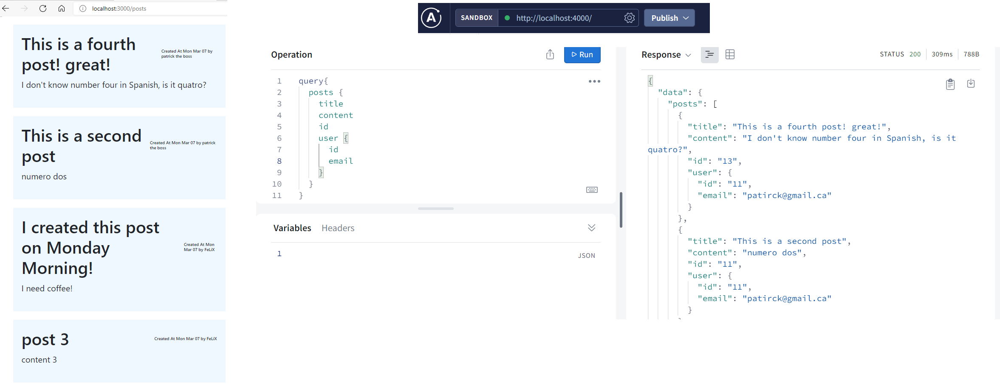

# blog-app


 ## This repository contains a simple blog-app that includes a graphQL server, alongside a simple React client.
The goal of this project was to learn GraphQL via a simple basic project. The project is a blog app that allows users to sign-up and create a Profile on which they post blogs. Users can view other profiles alongside the blogs that other users have published.The project uses AWS DynamoDB on the backend, and GraphQL as an interface to query the database. The front-end is a simple React application that queries the backend server for data.

### Profile
Users have a profile on which all of their posts are displayed. If a user is logged-in and authenticated, they have ability to click the "Add Post" button to add a post. Users can "publish" or "unpublish" a post, which makes it visible to all Users. All the data is stored in Prisma via GraphQL queries.


### Posts
Users can see all the posts that all users have posted & published. This is displayed in the front-end via a GraphQL query.


### Authentication
Signup & Signin logic is handeled via mutations to GraphQL and storing the token front-end.


## To run the application locally:
 
### Download the repository:
Cone the repository into your local machine 
```
git clone https://github.com/Patrick-Erath/blog-app.git
```

### To run the project Locally, the client & server both need to be running seperate terminals. 
#### To run the Server:
Step 1. cd into the directory of the cloned app and navigate to the server folder
```
cd {path}/blog-app/server
```
Step 2. Download dependencies
```
npm install
```
Step 3. Run 
```
npm run start:dev
```

#### To run the Client
Step 1. cd into the directory of the cloned app and navigate to the client folder
```
cd {path}/blog-app/client
```
Step 2. Download dependencies
```
npm install
```
Step 3. Run 
```
npm run start
```
